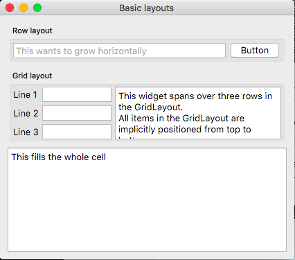

## BUILD

### OSX

### Prepare
Qt 5.9 is the last version of Qt that node-qt5 will support. Make sure that you have Xcode installed. Under Xcode preferences locations, make sure there is a version set.

Install Qt 5 with homebrew:

```bash
$ brew install qt
```

The Homebrew formula for qt is keg only which means binaries like qmake will not be symlinked into your /usr/local/bin directory and therefore will not be available for node-qt5.

Then add to your shell configuration file:

```bash
$ echo 'export PATH="$(brew --prefix qt)/bin:$PATH"' >> ~/.bashrc
```
Or another solution, but not recommended because it will break on brew upgrade, is to force Homebrew to symlink those binaries into your /usr/local/bin directory:

```bash
$ brew link --force qt
```

Restart your terminal.

After running this command you should get the following output:

```bash
$ which qmake
/usr/local/bin/qmake
```

### Build

```bash
$ git clone https://github.com/anak10thn/node-qt5.git
$ cd node-qt5; npm install;
```

### Test
```bash
$ node examples/qml.js
```

